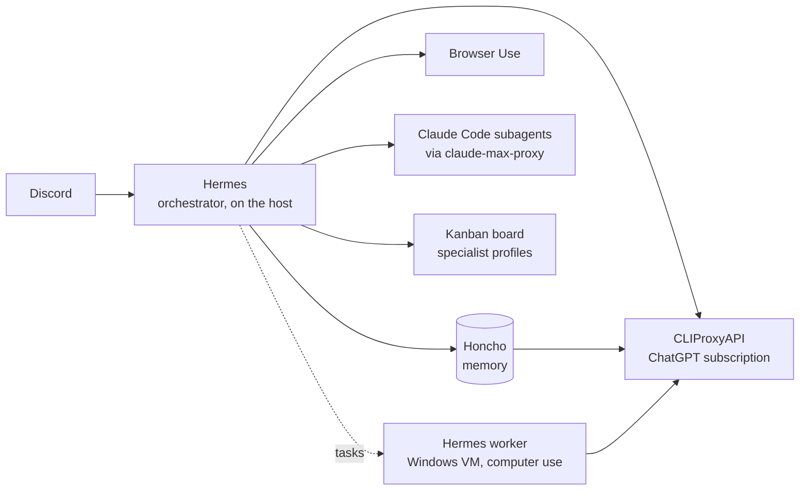

# agent-ops-kit

One controller, one chat surface, no API keys. Hermes runs your agent estate
from Discord: long-term memory in Honcho, browsing through Browser Use, coding
delegated to Claude Code, desktop work handed to a worker in a Windows VM, and
specialist agents with their own knowledge collaborating on a Kanban board.
Everything runs on the subscriptions you already have (ChatGPT and Claude Max)
through two local proxies.



## Quick start

On a Linux host with Docker:

```bash
git clone https://github.com/NorkzYT/agent-ops-kit.git /opt/agent-ops-kit
cd /opt/agent-ops-kit
make init                 # .env with secrets, proxy config, proxy sources
make up                   # Honcho + Ollama + CLIProxyAPI + claude-max-proxy
make auth-codex           # sign in with the ChatGPT account
make auth-claude-proxy    # sign in with the Claude Max account, paste token into .env
$EDITOR .env              # DISCORD_BOT_TOKEN, DISCORD_ALLOWED_USERS, DISCORD_HOME_CHANNEL
make hermes-install       # install Hermes, wire it up, start the Discord gateway
make doctor
```

Then @mention the bot in Discord. Full walkthrough: [docs/install.md](docs/install.md).

## What is in the box

| Piece | Where it runs | What it does |
|-------|---------------|--------------|
| Hermes | host, `~/.hermes` | the agent: Discord gateway, tools, cron, delegation, profiles, Kanban |
| Honcho | Docker | long-term memory of you, self-hosted, reasoning via your ChatGPT subscription |
| Ollama | Docker | local embedding model for Honcho, so no embeddings API key |
| CLIProxyAPI | Docker `:8317` | ChatGPT subscription as an OpenAI-compatible API |
| claude-max-proxy | Docker `:3456` | Claude Max subscription as an OpenAI-compatible API, with Claude Code inside |
| Browser Use | host (or Cloud) | the browser backend Hermes drives |
| Windows worker | your VM | a second Hermes with computer use for GUI-only tasks |
| `.claude/` kit | any repo | hooks, agents and skills that make Claude Code a careful coding worker |

## How a task flows

1. You ask in Discord. Hermes checks memory, triages, and picks a route.
2. Coding goes to a Claude subagent (`delegate_task`) that follows the `coder`
   profile: triage, plan, implement, verify, commit on a branch, report.
3. Web work uses the browser tools; you handle logins and MFA.
4. Desktop-only work becomes a Kanban task for `windows-operator`.
5. Specialist questions (marketing, strategy, security, research) become
   Kanban tasks for those profiles; the orchestrator synthesises one answer.
6. Hermes verifies before it says done, and writes what it learned to Honcho.

## Specialist agents

Each profile is a folder with a `SOUL.md` and a `knowledge/` directory. Feed
it books as `.md` or `.txt`, run `/learn`, and it answers from them with
citations. Give it a Discord bot of its own if you want to talk to it directly.
Teams are pipelines on the Kanban board: research, draft, critique, revise,
final. See [docs/profiles-and-teams.md](docs/profiles-and-teams.md).

```bash
make hermes-profile NAME=marketing
hermes kanban create "Positioning for the new plan" --assignee marketing
```

## Repository layout

```
docker-compose.yml        Honcho, Ollama, CLIProxyAPI, claude-max-proxy
Makefile                  init, up, auth-*, models, doctor, hermes-install, hermes-profile
.env.example              every setting, commented
scripts/                  stack-init, hermes-install, hermes-profile, doctor, windows-vm/
hermes/                   config templates, SOUL.md, profiles/, teams/, skills/, cron-jobs.md
docker/                   cliproxyapi config template, honcho init, ollama entrypoint
docs/                     install, hermes, honcho, proxies, browser-use, profiles, windows, troubleshooting
.claude/                  the Claude Code kit (installable into other repos with install.sh)
```

## Documentation

- [docs/install.md](docs/install.md), [docs/troubleshooting.md](docs/troubleshooting.md)
- [docs/hermes.md](docs/hermes.md), [docs/honcho.md](docs/honcho.md), [docs/proxies.md](docs/proxies.md)
- [docs/browser-use.md](docs/browser-use.md), [docs/profiles-and-teams.md](docs/profiles-and-teams.md), [docs/windows-vm-worker.md](docs/windows-vm-worker.md)
- Upstream: [Hermes](https://hermes-agent.nousresearch.com/docs), [Honcho](https://honcho.dev/docs), [Browser Use](https://docs.browser-use.com), [CLIProxyAPI](https://github.com/router-for-me/CLIProxyAPI), [claude-max-api-proxy](https://github.com/NorkzYT/claude-max-api-proxy)

## The Claude Code kit

`.claude/` is the coding worker's rulebook: a bash guard, protected files,
auto-format, session logging, staged agents (autopilot, triage, fixer,
closer), skills, and an eval harness. It installs into any repo:

```bash
curl -fsSL https://raw.githubusercontent.com/NorkzYT/agent-ops-kit/main/install.sh \
  | bash -s -- --repo NorkzYT/agent-ops-kit --ref main --force
```

Details in [docs/workflow.md](docs/workflow.md) and `.claude/CLAUDE.md`.

## Principles

1. One controller. Hermes decides; everything else is a tool or a worker.
2. Subscriptions, not API keys. The proxies are adapters and can be swapped.
3. You own logins, MFA, purchases and anything public. The agents wait.
4. Verify before "done". Tests run, pages open, files read back.
5. Smallest change that satisfies the task. Feature branches, never `main`.

## Contributors

Thanks to [@Breadfishman](https://github.com/Breadfishman) for close collaboration on the earlier Claude Code kit that this repo grew out of.

## License

GPL-3.0. See [LICENSE](LICENSE).
